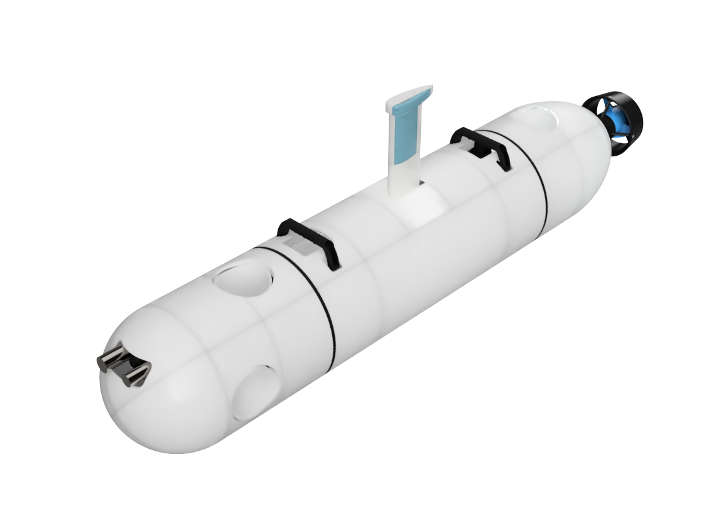
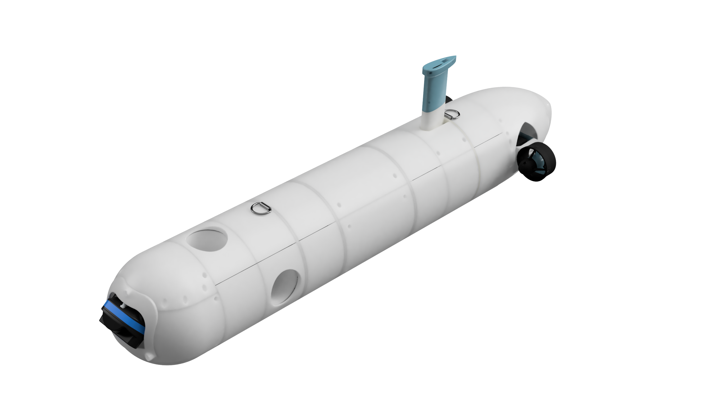

# Alpha Core AUV

This repository contains source codes for ALPHA AUV family.

ALPHA Science AUV


ALPHA Imaging AUV


## Directory Structure

`alpha_driver`
Driver package for the micro controller inside the ALPHA AUVs.

`alpha_localization`
Localization configuration for ALPHA AUVs.

## Installation

### Clone the repository

```bash
git clone --single-branch --branch noetic-devel https://github.com/uri-ocean-robotics/alpha_core
cd alpha_core
git submodule update --init --recursive
```

### MVP Installation

Currently MVP packages should be build from the source.
Target platform must be Ubuntu 20.04 because of the dependencies.

Pull repository and other dependencies
```bash
git clone --single-branch --branch noetic-devel https://github.com/uri-ocean-robotics/mvp_msgs
```

### Install Dependencies

Install dependencies
```bash
rosdep install --from-paths src --ignore-src --rosdistro ${ROS_DISTRO} -y
```

## Citation

If you find this software useful in your research, please cite:

> Note, this work is published in OCEANS 2022 conference. Once the paper is publicly available, bibtex entry
will be updated with the one from IEEExplore.

```
@inproceedings{
    ALPHA_PAPER,
    title = {Acrobatic Low-cost Portable Hybrid AUV (ALPHA): System Design and Preliminary Results},
    author={Zhou, Mingxi and Gezer, Emir Cem and McConnell, William and Yuan, Chengzhi},
    booktitle={OCEANS 2022: Hampton Roads},
    year={2022},
    organization={IEEE}
}
```

## Funding
This work is supported by the [National Science Foundation](https://www.nsf.gov/) award [#2154901](https://www.nsf.gov/awardsearch/showAward?AWD_ID=2154901&HistoricalAwards=false)
